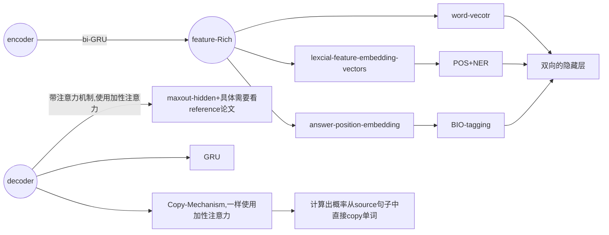
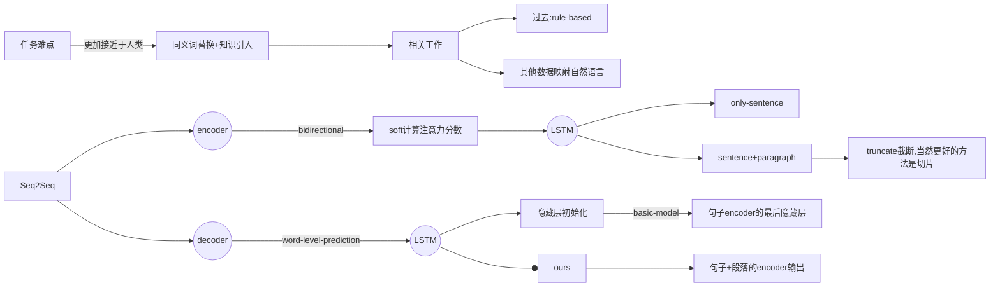
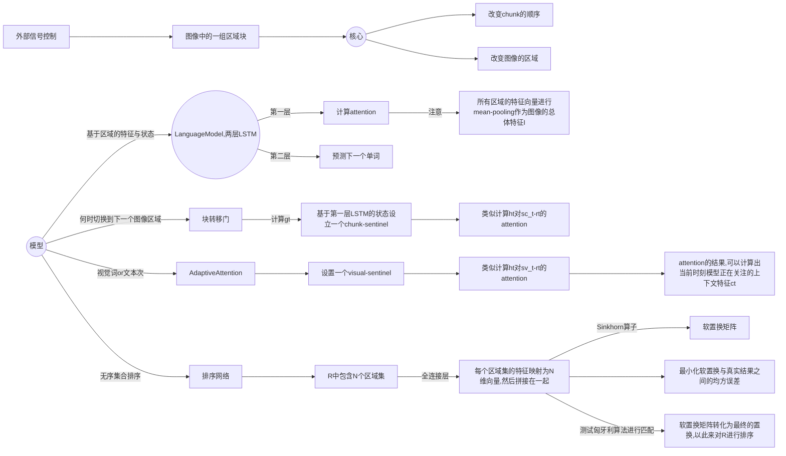
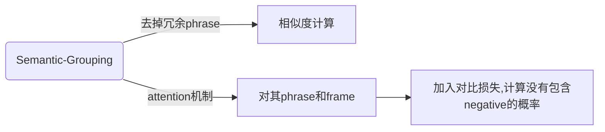

# Knowledge-enriched Text Generation paper reading

😎 Awesome list of papers about knowledge-enhanced Question generation with notes.

:white_check_mark: : **already reading carefully**

:fire:: **high citation in recent years**

:hammer_and_wrench:: **available code**

> Content

[TOC]


---

## :grey_question: Question Generation

---

### :mountain_snow: **Textual Question Generating Crosstalk**

**一、利用答案和语言特征**

1. **两篇Ground Breaking Work**

:white_check_mark: :fire: **Neural question generation from text: A preliminary study**, in EMNLP 2017. [[pdf](https://arxiv.org/abs/1704.01792)] 

* 在编码时额外考虑了答案位置与语法信息，取得了更好的性能。(现在来看非常**basic**重要的信息！)
  * word case 做训练时候的teacher forcing
  * answer position feature
  * lexical features
    * **POS**
    * **NER**




:white_check_mark: :fire: :hammer_and_wrench: **Learning to Ask: Neural Question Generation for Reading Comprehension**, in ACL 2017. [[pdf]](https://arxiv.org/abs/1705.00106) [[official code (torch)](https://github.com/xinyadu/nqg)]
* 将端到端训练的神经网络应用于问题生成
* 采用seq2seq+attention模型架构
* 摆脱了转换规则与模版的局限，取得了相比于传统方法更好的性能
* 加入了paragraph-level




2. **答案编码**

:white_check_mark: :fire: **Improving Neural Question Generation using Answer Separation**, in AAAI 2019.  [[pdf](https://arxiv.org/abs/1809.02393)] 
* 很多基础操作
* 在答案上做了简单高效的预处理
  * Mask 原文中的答案
  * 对答案中的关键信息做抽取，计算attention

3. **语言特征强化**

> 传统的有**POS**（词性标注）和**NER**（命名实体识别）。后续还有一些更加细微的处理

:fire: **Learning to Generate Questions by Learning What not to Generate**, in WWW 2019.  [[pdf](https://arxiv.org/pdf/1902.10418.pdf)] 

* clue 和 copy的机制
* 
* 
* 文章贡献
  * 帮助模型决策什么时候生成，什么时候copy
  * 生成多个问题

4. 疑问词类型（question type）

**Question-type Driven Question Generation**, in EMNLP 2019.  [[pdf](https://arxiv.org/pdf/1909.00140.pdf)]

* 引入对疑问词的预测模块，并且加入对应的损失函数
* 
* 
* 
* [损失函数引文](https://aclanthology.org/P17-1099.pdf)： 

**二、段落级别特征**

1. **强化段落级别文本的特征**

:fire: :hammer_and_wrench: **Paragraph-level Neural Question Generation with Maxout Pointer and Gated Self-attention Networks**, in EMNLP 2018. [[pdf](https://github.com/seanie12/neural-question-generation)] [[torch](https://github.com/seanie12/neural-question-generation)]

* 主要贡献都在模型上面，基于seq2seq设计：

  * gate self-attention: 个人觉得是一套很常用的框架，可以学习一下，也非常简单

  * Maxout ==**Pointer**== & Decoding **全新的处理 copy 机制**  (有空可以自行去看看代码！)

    * 之前copy得分：$\operatorname{sc}^{\text {copy }}\left(y_{t}\right)=\left\{\begin{array}{l}\sum_{k, \text { where } x_{k}=y_{t}} r_{t, k}, \quad y_{t} \in \chi \\ -i n f, \text{otherwise}\end{array} \quad\right.$ , 问题在于若文章中某个单词重复出现多次，则对该单词copy也会多，影响语句通顺。

    * 为此改进为Maxout Pointer：
      $$
      \operatorname{sc}^{\text {copy }}\left(y_{t}\right)= \begin{cases}\max _{k, \text { where } x_{k}=y_{t}} r_{t, k}, & y_{t} \in \chi \\ -i n f, & \text { otherwise }\end{cases}
      $$

:fire: **Natural Question Generation with Reinforcement Learning Based Graph-to-Sequence Model**,in ICLR 2020. [[pdf](https://arxiv.org/abs/1908.04942)] [[torch](https://github.com/hugochan/RL-based-Graph2Seq-for-NQG.)]

* 将passage和answer的表示（包含bert向量，glove向量，词汇特征等）进行多次反复的交互进行编码（**非常细节**的deep alignment network）
* 利用GNN来编码（使用了两种方式）：
  * 对sentence做**dependency parsing**，然后相邻的句子链接得到passage的图
  * 通过self attention的方式得到passage 的图（权值矩阵）

:fire: **Improving Question Generation With to the Point Context**, in EMNLP 2019.  [[pdf](https://aclanthology.org/D19-1317.pdf)]

* 联合建模非结构化句子（原文）和结构化答案相关关系（ answer-relevant relation 预先从句子中提取）以生成问题(**抓取重点上下文**)
* 作者发现上下文中，距离ansewr比较远的词并不一定不重要，相对的跟answer紧贴的词也有很多无关的，为了捕捉这种关系，作者使用**OpenIE**这个工具抽取上下文中存在的**关系三元组**。

**三、多任务训练**

**Multi-Task Learning with Language Modeling for Question Generation**, in EMNLP 2019. [[pdf](http://aclanthology.lst.uni-saarland.de/D19-1337.pdf)]

* 把语言模型（预测前后词）和QG作为multi-task一起进行训练。
* 两个任务是层级的关系，先进行语言模型的预测，然后将语言模型的hidden作为特征提供给后面seq2seq

:fire: **Improving Question Generation with Sentence-level Semantic Matching and Answer Position Inferring**, in AAAI 2019.  [[pdf](https://arxiv.org/abs/1912.00879)]

* 出发点是是**解决生成错误的疑问词**和**copy原文中无关词**的问题

* 作者认为生成错误词的原因是没有正确的利用**answer position**信息，copy无关词的原因是缺乏**局部语义信息**。

* 为了分别缓解这两个问题，作者也是设计了两个辅助任务：

  * 语义匹配分类：这个任务的设计出发点也是SQuAD的数据特点，对于一个passage存在多个answer-question训练数据，模型对这样的数据容易产生一些宽泛不具体的问题。所以作者把passage-question作为正样本，passage-random selected question， random selected passage-question作为负样本进行分类任务。

  

  * answer-postion位置预测：了让模型更好的利用answer信息，设计了一个预测answer在上下文中start和end位置的模型（pointer network），其中基础的编码部分采用BiDAF的方式。
  * 然后**QG和这两个辅助任务一起训练**，效果可。


****

### :sunrise: Visual QG

:hammer_and_wrench: **[No Visual] Entity Guided Question Generation with Contextual Structure and Sequence Information Capturing**, in AAAI 2021. [[pdf](https://ojs.aaai.org/index.php/AAAI/article/view/17544)] [[torch](https://github.com/VISLANG-Lab/EGSS)]

* Multi-feature Encoder: 使用了POS（词性标注）+ NER（关系抽取）

:hammer_and_wrench: **Multiple Objects-Aware Visual Question Generation**, in ACM MM 2021. [[pdf](https://dl.acm.org/doi/abs/10.1145/3474085.3476969)]
* **写作上写得很实在，很容易懂**，有很多承上启下的句子。
* 首次将**对象**融入到问题生成任务当中


:hammer_and_wrench:  **Difficulty-Controllable Visual Question Generation**, in APWeb-WAIM 2021. [[pdf](https://link.springer.com/content/pdf/10.1007/978-3-030-85896-4_26.pdf)]

* **难度可控**的问题生成：采用了教育学领域收集好的问题难度标签(DIF), 详见[链接](https://www.apims.net/index.php/apims/article/view/9)
* 在VQA2.0数据集的基础上构建了一个包含区分为容易和难的问题数据集
  * 引入两个VQA的模型来进行回答，都回答对的为容易，都回答错误就是难的

* 
  * 其中Difficulty Variable就是$\{0, 1\}$


### :video_camera: Video QG

**Video Question Generation via Semantic Rich Cross-Modal Self-Attention Networks Learning**, in ICASSP 2020. [[pdf](https://ieeexplore.ieee.org/document/9053476)]

* 使用了**[TVQA](https://paperswithcode.com/dataset/tvqa)**数据集，is based on 6 popular TV shows and consists of **152,545 QA pairs** from **21,793 clips**.
* 总体没什么创新的

**Multi-Turn Video Question Generation via Reinforced Multi-Choice Attention Network**, in T-CSVT 2021.[[pdf](https://ieeexplore.ieee.org/stamp/stamp.jsp?tp=&arnumber=9161024)]

* Multi-Turn（M-VQG）：结合多轮对话+视频信息
* 优点： 利用动态场景信息，问题可回答性，对话记录信息抽取
* 方法：baseline方法，强化学习（看不懂）

**End-to-End Video Question-Answer Generation with Generator-Pretester Network**, in T-CSVT 2021. [[pdf](https://arxiv.org/pdf/2101.01447.pdf)]

* 引入一问一答的形式，生成问题和答案，然后测试答案是否正确
* 硬件平台：NVIDIA DGX-1（8 * V100）

### :sun_with_face: QG examples

:white_check_mark:  :hammer_and_wrench:  **Mixture Content Selection for Diverse Sequence Generation**, in EMNLP 2019.[[pdf](https://arxiv.org/abs/1909.01953)] [[torch](https://github.com/clovaai/FocusSeq2Seq)]

:hammer_and_wrench: **Radial Graph Convolutional Network for Visual Question Generation**, in IEEE Transactions on Neural Networks and Learning Systems 2020. [[pdf](https://ieeexplore.ieee.org/document/9079208)] [[torch](https://github.com/Wangt-CN/VQG-GCN)]

## :bookmark_tabs: Question Answering

---

:fire:  :hammer_and_wrench: **[Question Answering] Commonsense for Generative Multi-Hop Question Answering Tasks**, in EMNLP 2018. [[pdf\]](https://arxiv.org/abs/1809.06309) [[code (tf)\]](https://github.com/yicheng-w/CommonSenseMultiHopQA)

:hammer_and_wrench: **[Dialogue System] Improving Knowledge-aware Dialogue Generation via Knowledge Base Question Answering**, in AAAI 2020. [[pdf\]](https://arxiv.org/abs/1912.07491) [[code (torch)\]](https://github.com/siat-nlp/TransDG)

**[Question Answering] Using Local Knowledge Graph Construction to Scale Seq2Seq Models to Multi-Document Inputs**, in EMNLP 2019. [[pdf\]](https://arxiv.org/abs/1910.08435)

:fire: :hammer_and_wrench: **[Question Answering] ** **Improving Multi-hop Question Answering over Knowledge Graphs usingKnowledge Base Embeddings**, in ACL 2020. [[pdf](https://aclanthology.org/2020.acl-main.412/)] [[torch](https://github.com/malllabiisc/EmbedKGQA)]


## :book: Paraphrase

---


:hammer_and_wrench: **[Sentence Discrimination] Learning Semantic Sentence Embeddings using Sequential Pair-wise Discriminator**,in COLING 2018. [[pdf](https://aclanthology.org/C18-1230/)] [[torch](https://github.com/badripatro/PQG)]

:hammer_and_wrench: **[Hierarchical Sketch&Paraphrase Generation] Hierarchical Sketch Induction for Paraphrase Generation**, in ACL 2022.[[pdf](https://aclanthology.org/2022.acl-long.178.pdf)] [[torch](https://github.com/tomhosking/hrq-vae)]

### :whale2: Related Big Model

:fire: :hammer_and_wrench: **[Cross-Modal&Contrastive Learning] UNIMO: Towards Unified-Modal Understanding and Generation via Cross-Modal Contrastive Learning**, in ACL(long paper) 2021. [[pdf](https://aclanthology.org/2021.acl-long.202/)] [[project from Baidu](https://unimo-ptm.github.io/)]

:hammer_and_wrench: **[MultiModal] UniT: Multimodal Multitask Learning with a Unified Transformer**, ICCV 2021. [[pdf](https://openaccess.thecvf.com/content/ICCV2021/papers/Hu_UniT_Multimodal_Multitask_Learning_With_a_Unified_Transformer_ICCV_2021_paper.pdf)] [[project from Fair](https://mmf.sh/)]

## :framed_picture: Image Caption

---


:white_check_mark: :hammer_and_wrench: **[Image Caption] Generating Diverse and Descriptive Image Captions Using Visual Paraphrases**, in ICCV 2019. [[pdf](https://ieeexplore.ieee.org/document/9010984)] [[torch](https://github.com/pkuliu/visual-paraphrases-captioning)]

* 该论文研究了目前图像的文本描述的**多样性**和**具体性**缺乏的问题，提出了一种基于视觉复述的两阶段解码的模型。
  * 给定图像输入，该模型首先生成初步的句子，再将其改写为内容更加多样和丰富的描述。在MS COCO图像描述数据集上的实验显示，方法可以显著提升文本描述的**多样性**和**具体性**。

  * 重点探索**visual paraphrases** 角色 + **scoring function**
  
    * ```mermaid
      graph LR
      与人类相比 --文章中有example--> 缺少多样性和具体性 --> 两阶段视觉复述方法 --> MSCOCO数据集
      ```
  
  
  * 故事展开:
  
    * ```mermaid
      graph LR
      标准 -->流畅+相关+多样+具体 --多样性--> 形容词
      流畅+相关+多样+具体 --多样性--> 细节,with
      形容词 --> Pa((Paraphrase))
      细节,with --> Pa
      Pa --> visual-paraphrase
      visual-paraphrase --> sentence_pairs --> 两阶段编码
      ```
  
    * ```mermaid
      graph LR
      相关工作 --caption--> 多caption.vs.单caption --paraphrases--> 未处理特征和视觉信息 --两阶段编码--> 中间seq.vs.2captions 
      ```
  
  
  * 模型方法：
  
    * ```mermaid
      graph LR
      选择视觉复述caption对 --> 评分函数 --> 设计三个Attention操作,学习到多模态知识 --> 最后softmax输出
      ```

* 更多细节可见我个人的[slide](https://kdocs.cn/l/conDzdschwAn)

:white_check_mark: ::fire: :hammer_and_wrench: **[Text Generation & Image Caption] Show, Control and Tell: A Framework for Generating Controllable and Grounded Captions**, in CVPR 2019. [[pdf](https://openaccess.thecvf.com/content_CVPR_2019/html/Cornia_Show_Control_and_Tell_A_Framework_for_Generating_Controllable_and_CVPR_2019_paper.html)] [[torch](https://github.com/aimagelab/show-control-and-tell)]




 [详细讲解](https://zhuanlan.zhihu.com/p/150667499)


:hammer_and_wrench: **Injecting Semantic Concepts into End-to-End Image Captioning**, in CVPR 2022.  [[pdf](https://arxiv.org/abs/2112.05230)]  [[torch](https://github.com/jacobswan1/ViTCAP)]

* 端到端的训练，detector-free
* 加入Concept
  * 通过抽取caption中的动名词或者通过知识蒸馏得到一些图像标签

## :sunglasses: Video Understanding

### :video_camera: Features Fusion

:white_check_mark: :fire: :hammer_and_wrench: **[TSN] Temporal Segment Networks: Towards Good Practices for Deep Action Recognition**, in ECCV 2016.  [[pdf](https://arxiv.org/abs/1608.00859)]  [[torch](https://github.com/yjxiong/temporal-segment-networks)]

* 抽取所有帧是不现实的，TSN将其**等间隔分**为$K$个片段（i.e., $K=16$）,在每个片段中谁寄抽取一帧作为输入

* 提供了非常常用的数据争强方式和一些训练时候的trick（主要包括location jittering, horizontal flipping, corner cropping, and scale jittering）

* 仍然利用双流的思路，让每个片段信息最后通过一个共识网络再Fusion

  

:white_check_mark: :fire: :hammer_and_wrench: **[TRN] Temporal Relation Reasoning in Videos**, in ECCV 2018.  [[pdf]()] [[torch](https://github.com/zhoubolei/TRN-pytorch)]


* 融合尺度确定 (需要多少个视频帧来融合)【如图所示】有2，3，4这三种尺度
* 每个尺度下需要多少组视频帧
* 在应用多尺度TRN的时候，一般会额外增加一个全帧的尺度，即12帧特征全部concat到一起，以充分利用有效信息。
* **平衡**效果和计算速度，**简单好用**

:white_check_mark: :fire: :hammer_and_wrench: **[TSM] TSM: Temporal Shift Module for Efficient Video Understanding**, in ICCV 2019.  [[pdf](https://arxiv.org/abs/1811.08383)] [[torch](https://github.com/mit-han-lab/temporal-shift-module)]

* 对某些通道shift，得到前一帧或者后一帧的特征

  

* 由于shift是有损失的，为此设计残差来进行弥补（原来的与残差的对比）


:white_check_mark: :fire: :hammer_and_wrench: **[LRCN] Long-term Recurrent Convolutional Networks for Visual Recognition and Description**, in CVPR 2015.  [[pdf](https://www.cv-foundation.org/openaccess/content_cvpr_2015/papers/Donahue_Long-Term_Recurrent_Convolutional_2015_CVPR_paper.pdf)] [[torch](https://github.com/garythung/torch-lrcn)]

* CNN抽出来的帧特征再放进去`LSTM`得到每帧的时序特征

> 关于视频特征抽取，下面讲一下`netvlad`系列的结构,NextVlad就是专门针对视频帧融合来做的优化。
>
> [相关博客链接](https://zhuanlan.zhihu.com/p/385512915)

:fire: :hammer_and_wrench: **[NetVLAD] NetVLAD: CNN architecture for weakly supervised place recognition**, in CVPR 2016.  [[pdf](https://openaccess.thecvf.com/content_cvpr_2016/papers/Arandjelovic_NetVLAD_CNN_Architecture_CVPR_2016_paper.pdf)] [[torch (simple)](https://github.com/lyakaap/NetVLAD-pytorch)]

* VLAD算法（实际上就是Kmeans）：
  $$
  V(j, k)=\sum_{i=1}^{N} a_{k}\left(x_{i}\right)\left(x_{i}(j)-c_{k}(j)\right), \quad k \in K, j \in D
  $$

* 本文使用`CNN`模拟该VLAD算法的过程

  * 平滑化$\alpha$ 使其变成一个0-1分布的权重参数，使用$1 \times 1$卷积+softmax 进行该过程，平滑推导公式$\bar{a}_{k}\left(\mathbf{x}_{i}\right)=\frac{e^{-\alpha\left\|\mathbf{x}_{i}-\mathbf{c}_{k}\right\|^{2}}}{\sum_{k^{\prime}} e^{-\alpha\left\|\mathbf{x}_{i}-\mathbf{c}_{k^{\prime}}\right\|^{2}}}$

  

  

   

:fire: :hammer_and_wrench: **[NextVLAD] NeXtVLAD: An Efficient Neural Network to Aggregate Frame-level Features for Large-scale Video Classification**, in ECCV workshop 2018.  [[pdf](https://arxiv.org/pdf/1811.05014.pdf)] [[tensorflow](https://github.com/linrongc/youtube-8m)]

> 同时，还有[关于多模态（视频-文本）Transformer模型的博客链接](https://zhuanlan.zhihu.com/p/388361095)


### :timer_clock: Temporal Grounding

> 我们使用一个十分经典的任务（Temporal Grounding）来看看视频的特征是如何利用的

:fire::hammer_and_wrench: **[Video-NLP] Learning 2D Temporal Adjacent Networks for Moment Localization with Natural Language**, in AAAI 2020.  [[pdf](https://arxiv.org/pdf/1912.03590.pdf)] [[torch](https://github.com/microsoft/VideoX)]

> extend version: **MS-2D-TAN**, in TPAMI 2021.  [[pdf](https://arxiv.org/pdf/2012.02646.pdf)]  [[torch](https://github.com/microsoft/VideoX)]

* 2D: start time & end time 构成的邻接矩阵


* **核心思想**：

  * 使用max pooling （本文使用） 或者 stack convolution的获取moment feature，如上图`2D Temporal Feature Map Extraction`所示
  * 由于这样子的计算开销太大了，使用**特定的采样方式**进行调整，详见论文！（距离近的采样多一点，远的采样少一点）
  * 多模态融合（`Hadamard product`）

  $$
  \mathbf{F}=\left\|\left(\mathbf{w}^{S} \cdot \mathbf{f}^{S} \cdot \mathbb{1}^{T}\right) \odot\left(\mathbf{W}^{M} \cdot \mathbf{F}^{M}\right)\right\|_{F}
  $$

  * 损失计算时候，对`IoU`进行一个scale变成监督信号

  $$
  y_{i}= \begin{cases}0 & o_{i} \leq t_{\min } \\ \frac{o_{i}-t_{\min }}{t_{\max }-t_{\min }} & t_{\min }<o_{i}<t_{\max } \\ 1 & o_{i} \geq t_{\max }\end{cases}
  $$

  * BCE loss:

  $$
  L o s s=\frac{1}{C} \sum_{i=1}^{C} y_{i} \log p_{i}+\left(1-y_{i}\right) \log \left(1-p_{i}\right)
  $$

  

:fire: :hammer_and_wrench: **Negative Sample Matters: A Renaissance of Metric Learning for Temporal Grounding**, in AAAI 2022. [[pdf](https://arxiv.org/abs/2109.04872)] [[torch](https://github.com/MCG-NJU/MMN)] [[blog](https://zhuanlan.zhihu.com/p/446203594)]

* 主干网络是沿用[TDN](https://arxiv.org/abs/2012.10071)

* 使用了**metric learning**的方法并且引入**负样本**来做Temporal Grounding的任务

  * 视频间的负样本（`IoU`来标定监督信号`yi`，与`2D-TAN`一样处理得来的，记得`scale`一下）
  * 文本中的负样本，从其他视频的文本语句当中选取出来

* 贡献

  * 构造了新的监督信号：视频间的正负样本(`IoU`来采样)， 句子和视频对应的正负样本（负样本句子从别的视频抽取过来）
  * 一个视频只需要建模一次，大大节省训练时间，以往的fusion方法都是要文本-视频帧对来建模

* Trick

  * 为了编码公平，使用预训练好的`DistilBERT`来进行编码句子

* 损失函数计算

  * 和`2D-TDN`一样的`BCE_loss`
  * 类似于`InfoNCE loss`的设计对比损失

  $$
  \begin{aligned}
  &p\left(i_{s} \mid v\right)=\frac{\exp \left(\left(\mathbf{f}_{i}^{S T} \mathbf{f}^{V}-m\right) / \tau_{v}\right)}{\exp \left(\left(\mathbf{f}_{i}^{S T} \mathbf{f}^{V}-m\right) / \tau_{v}\right)+\sum_{j \neq i}^{N_{s}} \exp \left(\mathbf{f}_{j}^{S T} \mathbf{f}^{V} / \tau_{v}\right)} \\
  &p\left(i_{v} \mid s\right)=\frac{\exp \left(\left(\mathbf{f}_{i}^{V T} \mathbf{f}^{S}-m\right) / \tau_{s}\right)}{\exp \left(\left(\mathbf{f}_{i}^{V T} \mathbf{f}^{S}-m\right) / \tau_{s}\right)+\sum_{j \neq i}^{N_{v}} \exp \left(\mathbf{f}_{j}^{V T} \mathbf{f}^{S} / \tau_{s}\right)} \\
  &L_{m m}=-\left(\sum_{i=1}^{N} \log p\left(i_{v} \mid s_{i}\right)+\sum_{i=1}^{N} \log p\left(i_{s} \mid v_{i}\right)\right)
  \end{aligned}
  $$

  

### :man_student: Video Question Answer

**Invariant Grounding for Video Question Answering**, in CVPR 2022 oral.  [[pdf](https://openaccess.thecvf.com/content/CVPR2022/papers/Li_Invariant_Grounding_for_Video_Question_Answering_CVPR_2022_paper.pdf)] [[torch](https://github.com/yl3800/IGV)]

> 这篇文章感觉是一篇很标准的`CVPR`的中规中矩文章，写作用词上非常出色的

* 先做了Grounding的检测，检测出问题相关帧（有因果关系`Casual`）还有无关帧（补偿帧`Complement`）
* 构建负样本到无关帧当中，使用`memory bank`来存储所有样本 (因此要注意存储的特征维度不能太大)

### :writing_hand: Video Caption

**[Video Caption] VX2TEXT: End-to-End Learning of Video-Based Text Generation From Multimodal Inputs**, in CVPR 2021. [[pdf](https://arxiv.org/abs/2101.12059)]

:hammer_and_wrench: :fire: **[Video Caption] Robust Change Captioning**, in ICCV 2019. [[pdf](https://arxiv.org/pdf/1901.02527.pdf)] [[torch](https://github.com/Seth-Park/RobustChangeCaptioning)]

* 输入为前后图像对，五种变化类型（color/material change,adding/dropping/moving an object）
* 提出一个有视点变化的数据集[CLEVR-Change](https://cs.stanford.edu/people/jcjohns/clevr/)（80K图片对），并在无视点变化的数据集[Spot-the-Diff](https://github.com/harsh19/spot-the-diff)取得SOTA效果。
* 模型：Dual 注意力， 分辨**视点变化**， 其实是通过输入两张差不多的图片，提前标定好数据集获得的，有点被坑的意思

:hammer_and_wrench: :fire: **[Video Caption] Semantic Grouping Network for Video Captioning**, in AAAI 2021. [[pdf](https://arxiv.org/pdf/2102.00831.pdf)] [[torch](https://github.com/hobincar/SGN)]

* 

:hammer_and_wrench: :fire: **Hierarchical Context-aware Network for Dense Video Event Captioning**, in ACL 2021. [[pdf](https://aclanthology.org/2021.acl-long.156/)] [[torch](https://github.com/KirkGuo/HCN)]

* **局部信息**+**全局信息**结合生成dense caption （输入包括**video** 和 **transcript**）
* 为此设计了两套`Attention`机制
  * falt attention + cross attention


* 设计了门机制来decode（之前的文本信息与未来的文本信息）




**对比损失**$\mathcal{L}_{c a}=\sum_{(V, Y) \in \mathcal{D}} \sum_{t} \sum_{i}^{M_{t}}\left(-\log p_{c a}\left(s_{i, t}\right)\right)$, $p_{c a}\left(s_{i, t}\right)=\sum_{j=1}^{N} \alpha_{i, j, t}^{p o s}$    ($\alpha^{pos}$ 为正样本时候对齐注意力的权重) 


## :abc: Scene Text Recognization

:hammer_and_wrench: **From Two to One: A New Scene Text Recognizer with Visual Language Modeling Network**, in ICCV 2021. [[pdf](https://link.zhihu.com/?target=https%3A//arxiv.org/abs/2108.09661)] [[torch](https://link.zhihu.com/?target=https%3A//github.com/wangyuxin87/VisionLAN)]

* 过去的场景文本识别需要：视觉特征抽取器 + 语言模型

* 本文直接在视觉空间进行语言建模（类似人类，语言信息是可以学习的）
  * 对字符级别的Mask操作
    * 训练过程，采用弱监督互补学习

:hammer_and_wrench: **Visual Semantics Allow for Textual Reasoning Better in Scene Text Recognition**, in AAAI 2022.  [[pdf]([https://arxiv.org/abs/2112.12916](https://link.zhihu.com/?target=https%3A//arxiv.org/abs/2112.12916))] [[torch]([https://github.com/adeline-cs/GTR](https://link.zhihu.com/?target=https%3A//github.com/adeline-cs/GTR))]
* 加入一个GCN强化了视觉学习的过程，并且做了一个fusion


## :label: NER

>  Named Entity Recognition

**当前竞赛NER任务的baseline：**

- BERT + BILSTM + CRF
- [博客连接 NER铁打的baseline](https://zhuanlan.zhihu.com/p/166496466)

:fire: **Bidirectional LSTM-CRF Models for Sequence Tagging**, in 2015. [[pdf](https://arxiv.org/pdf/1508.01991v1.pdf)] [[code](https://paperswithcode.com/paper/bidirectional-lstm-crf-models-for-sequence)

* 使用BiLSTM+CRF做NER的开山之作
* [相关博客连接](https://zhuanlan.zhihu.com/p/166496466)

:hammer_and_wrench: :fire: **Fast and Accurate Entity Recognition with Iterated Dilated Convolutions**, in EMNLP 2017.  [[pdf](https://arxiv.org/pdf/1702.02098.pdf)] [[tensorflow](https://github.com/iesl/dilated-cnn-ner)]

* Iterated Dilated Convolutions 空洞卷积 


* 核心思想

  * 传统卷积的问题：pooling层会**损失信息**，降低精度。那么不加pooling层会使**感受野变小**，学不到全局的特征。如果单纯的去掉pooling层、扩大卷积核的话，这样纯粹的扩大卷积核势必导致**计算量的增大**。
  * CNN也可以解决长距离依赖问题


* 速度比以前的`Bi-LSTM-CRF`快了非常多，而且精度没有下滑

:hammer_and_wrench: :fire: **BOND: BERT-Assisted Open-Domain Named Entity Recognition with Distant Supervision** , in KDD 2020.  [[pdf](https://arxiv.org/pdf/2006.15509.pdf)] [[torch](https://github.com/cliang1453/BOND)]

* 远距离监督的问题

  * 噪声，负样本不好生成
  * 完整性不足
  * `trade-off` 在标注准确度和覆盖范围之间

* 想法

  * 第一阶段使用`RoBERTa`微调，适应`NER`任务

    * 使用`Early stopping` 方法防止数据过拟合还有对**未知数据增强泛化能力**
    * 首先通过`POS`识别潜在实体，然后通过语料库计算最小损失确定实体

    

  * 第二阶段自我学习框架 （teacher-student模型2）

    * 应对**嘈杂和不完整标注**的挑战
    * teacher生成伪标签交给student去预测
    * **重新加权的高置信度软标签**
    * ==第二阶段的核心就是增强数据的置信程度！==


两阶段的BOND框架

* 在阶段I中，经过预训练的BERT用于早停的远距离NER任务
* 在阶段II中，首先从阶段I中学习的模型初始化student模型和teacher模型。然后使用teacher模型生成的伪标签对student模型进行训练。同时，由早停的student迭代更新teacher模型。


:hammer_and_wrench: :fire: **[A Boundary-aware Neural Model for Nested Named Entity Recognition](https://aclanthology.org/D19-1034.pdf)** , in EMNLP 2019.  [[pdf](https://aclanthology.org/D19-1034.pdf)] [[torch](https://github.com/thecharm/boundary-aware-nested-ner)]

* 解决`Nested NER`的问题
* 使用多任务学习方法
  * 预测边界
  * 预测实体分类

:hammer_and_wrench: :fire: **Cross-Domain NER using Cross-Domain Language** , in ACL 2020.  [[pdf](https://aclanthology.org/P19-1236/)] [[torch](https://github.com/jiachenwestlake/Cross-Domain_NER)]

* 解决**跨领域无监督**的标注问题
* 核心思想


最底下的一层是数据层，标准情况一下总共有四份语料，分别对应**两个domain下的两个task（NER和语言建模）**。其中Source Domain（即保证有标记数据用于NER的domain）对应之前提到的News Domain，因为论文中Source Domain使用的是新闻数据。另外如果是无监督抽取Target Domain数据则只有三份语料。

由底向上第二层是Word Embedding层，论文中的Word Embedding结合了词级别和字符级别的向量表示。即把词向量和一个词的字符序列形成的矩阵经过CNN处理后的**向量concatenate起来**。

第三层是双向LSTM，用于序列处理第二层的数据，生成前后向hidden state。

第四层LM和CRF，即task model层。我们可以看到第四层有三个模块，两个是用于NER的CRF模型，分别对应Source Domain和Target Domain。另一个是基于第三层BiLSTM的语言模型，NSSoftmax是指这个语言模型利用**Negative Sampling Softmax的方式进行训练**。


* 最关键的地方就是`Bi-LSTM`的参数是生成的，不同domain的不同task需要的LSTM的参数和$I$有关

$$
\begin{equation}
\theta_{\mathrm{LSTM}}^{d, t}=\mathbf{W} \otimes \mathbf{I}_{d}^{D} \otimes \mathbf{I}_{t}^{T},
\end{equation}
$$


**NER的未来**

既然模型打不动了，然后我找了找 ACL2020做NER的论文，看看现在的NER还在做哪些事情，主要分几个方面

1. **多特征**：实体识别不是一个特别复杂的任务，不需要太深入的模型，那么就是加特征，特征越多效果越好，所以字特征、词特征、词性特征、句法特征、KG表征等等的就一个个加吧，甚至有些中文 NER 任务里还加入了拼音特征、笔画特征...... 心有多大，特征就有多多
2. **多任务**：很多时候做 NER 的目的并不仅是为了 NER，而是服务于一个更大的目标或系统，比如信息抽取、问答系统等等。如果把整个大任务做一个端到端的模型，就需要做成一个多任务模型，把 NER 作为其中一个子任务；另外，单纯的 NER 也可以做成多任务，比如实体类型过多时，仅用一个序列标注任务来同时抽取实体与判断实体类型，会有些力不从心，就可以拆成两个子任务来做
3. **时令大杂烩**：把当下比较流行的深度学习话题或方法跟 NER 结合一下，比如结合强化学习的 NER、结合 **few-shot learning** 的 NER、结合多模态信息的 NER、结合跨语种学习的 NER 等等的，具体就不提了 (Few-shot + Cross-domain是个不错的选项！)

作者：王岳王院长
链接：https://zhuanlan.zhihu.com/p/166496466
来源：知乎
著作权归作者所有。商业转载请联系作者获得授权，非商业转载请注明出处。
