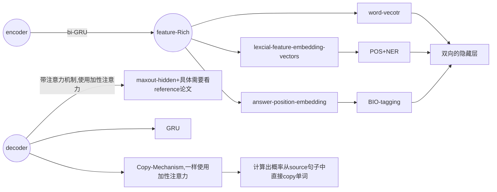

# Knowledge-enriched Text Generation paper reading

😎Awesome list of papers about knowledge-enhanced Question generation with notes.

:white_check_mark: : **already reading carefully**

:fire:: **high citation in recent years**

:hammer_and_wrench:: **available code**

---

## :grey_question: Question Generation

---

### :mountain_snow: Ground Breaking Work

* :white_check_mark::fire: :hammer_and_wrench: **Learning to Ask: Neural Question Generation for Reading Comprehension**, in ACL 2017. [[pdf]](https://arxiv.org/abs/1705.00106) [[official code (torch)](https://github.com/xinyadu/nqg)]
  * 将端到端训练的神经网络应用于问题生成
  * 采用seq2seq+attention模型架构
  * 摆脱了转换规则与模版的局限，取得了相比于传统方法更好的性能

```mermaid
graph LR
任务难点 --更加接近于人类--> 同义词替换+知识引入 --> 相关工作 --> 过去:rule-based 
相关工作 --> 其他数据映射自然语言

Seq2Seq --> en((encoder)) --bidirectional--> soft计算注意力分数 --> lstm((LSTM))  --> only-sentence
lstm --> sentence+paragraph --> truncate截断,当然更好的方法是切片

Seq2Seq --> de((decoder)) --word-level-prediction--> LSTM((LSTM)) --> 隐藏层初始化 --basic-model --> 句子encoder的最后隐藏层
LSTM --oours--> 句子+段落的encoder输出


```




* :white_check_mark: :fire: **Neural question generation from text: A preliminary study**, in EMNLP 2017. [[pdf](https://arxiv.org/abs/1704.01792)] 
  * 在编码时额外考虑了答案位置与语法信息，取得了更好的性能。




### :sun_with_face: QG examples

* :white_check_mark: :hammer_and_wrench: **Mixture Content Selection for Diverse Sequence Generation**, in EMNLP 2019.[[pdf](https://arxiv.org/abs/1909.01953)] [[torch](https://github.com/clovaai/FocusSeq2Seq)]
* :hammer_and_wrench: **Radial Graph Convolutional Network for Visual Question Generation**, in IEEE Transactions on Neural Networks and Learning Systems 2020. [[pdf](https://ieeexplore.ieee.org/document/9079208)] [[torch](https://github.com/Wangt-CN/VQG-GCN)]

## :bookmark_tabs: Question Answering

---

*  :fire: :hammer_and_wrench:**[Question Answering] Commonsense for Generative Multi-Hop Question Answering Tasks**, in EMNLP 2018. [[pdf\]](https://arxiv.org/abs/1809.06309) [[code (tf)\]](https://github.com/yicheng-w/CommonSenseMultiHopQA)
* :hammer_and_wrench:**[Dialogue System] Improving Knowledge-aware Dialogue Generation via Knowledge Base Question Answering**, in AAAI 2020. [[pdf\]](https://arxiv.org/abs/1912.07491) [[code (torch)\]](https://github.com/siat-nlp/TransDG)
* **[Question Answering] Using Local Knowledge Graph Construction to Scale Seq2Seq Models to Multi-Document Inputs**, in EMNLP 2019. [[pdf\]](https://arxiv.org/abs/1910.08435)
* :fire::hammer_and_wrench:**[Question Answering] ** **Improving Multi-hop Question Answering over Knowledge Graphs usingKnowledge Base Embeddings**, in ACL 2020. [[pdf](https://aclanthology.org/2020.acl-main.412/)] [[torch](https://github.com/malllabiisc/EmbedKGQA)]


## :book: Other Related Topic

---


* :hammer_and_wrench:**[Sentence Discrimination] Learning Semantic Sentence Embeddings using Sequential Pair-wise Discriminator**,in COLING 2018. [[pdf](https://aclanthology.org/C18-1230/)] [[torch](https://github.com/badripatro/PQG)]


## :framed_picture: Image Caption

* :hammer_and_wrench:**[Image Caption] Generating Diverse and Descriptive Image Captions Using Visual Paraphrases**, in ICCV 2019. [[pdf](https://ieeexplore.ieee.org/document/9010984)] [[torch](https://github.com/pkuliu/visual-paraphrases-captioning)]
  * 该论文研究了目前图像的文本描述的**多样性**和**具体性**缺乏的问题，提出了一种基于视觉复述的两阶段解码的模型。
    * 给定图像输入，该模型首先生成初步的句子，再将其改写为内容更加多样和丰富的描述。在MS COCO图像描述数据集上的实验显示，方法可以显著提升文本描述的**多样性**和**具体性**。
  
  * 重点探索**visual paraphrases** 角色 + **scoring function**
  
    * ```mermaid
      graph LR
      与人类相比 --文章中有example--> 缺少多样性和具体性 --> 两阶段视觉复述方法 --> MSCOCO数据集
      ```
  
  * 故事展开:
  
    * ```mermaid
      graph LR
      标准 -->流畅+相关+多样+具体 --多样性--> 形容词
      流畅+相关+多样+具体 --多样性--> 细节,with
      形容词 --> Pa((Paraphrase))
      细节,with --> Pa
      Pa --> visual-paraphrase
      visual-paraphrase --> sentence_pairs --> 两阶段编码
      ```
  
    * ```mermaid
      graph LR
      相关工作 --caption--> 多caption.vs.单caption --paraphrases--> 未处理特征和视觉信息 --两阶段编码--> 中间seq.vs.2captions 
      ```
  
  * 模型方法：
  
    * ```mermaid
      graph LR
      选择视觉复述caption对 --> 评分函数 --> 设计三个Attention操作,学习到多模态知识 --> 最后softmax输出
      ```
  
  * 更多细节可见[slide](https://kdocs.cn/l/conDzdschwAn)


* :fire: :hammer_and_wrench:**[Text Generation & Image Caption] Show, Control and Tell: A Framework for Generating Controllable and Grounded Captions**, in CVPR 2019. [[pdf](https://openaccess.thecvf.com/content_CVPR_2019/html/Cornia_Show_Control_and_Tell_A_Framework_for_Generating_Controllable_and_CVPR_2019_paper.html)] [[torch](https://github.com/aimagelab/show-control-and-tell)]

  
  * center class="half">
    
    
    <center>
  
  * 
  
    ```mermaid
    graph LR
    外部信号控制 --> 图像中的一组区域块 --> core((核心))
    core --> 改变chunk的顺序
    core --> 改变图像的区域
    model((模型)) --基于区域的特征与状态--> LSTM((LanguageModel,两层LSTM)) --第一层--> 计算attention --注意--> 所有区域的特征向量进行mean-pooling作为图像的总体特征I
    LSTM --第二层--> 预测下一个单词
    model --何时切换到下一个图像区域--> 块转移门 --计算gt--> 基于第一层LSTM的状态设立一个chunk-sentinel --> 类似计算ht对sc_t-rt的attention
    model --视觉词or文本次--> AdaptiveAttention --> 设置一个visual-sentinel --> 类似计算ht对sv_t-rt的attention --> attention的结果,可以计算出当前时刻模型正在关注的上下文特征ct
    model --无序集合排序--> 排序网络 --> R中包含N个区域集 --全连接层--> 每个区域集的特征映射为N维向量,然后拼接在一起 --Sinkhorn算子--> 软置换矩阵 
    每个区域集的特征映射为N维向量,然后拼接在一起 --> 最小化软置换与真实结果之间的均方误差
    每个区域集的特征映射为N维向量,然后拼接在一起 --测试匈牙利算法进行匹配--> 软置换矩阵转化为最终的置换,以此来对R进行排序
    ```
  
  * [详细讲解](https://zhuanlan.zhihu.com/p/150667499)

